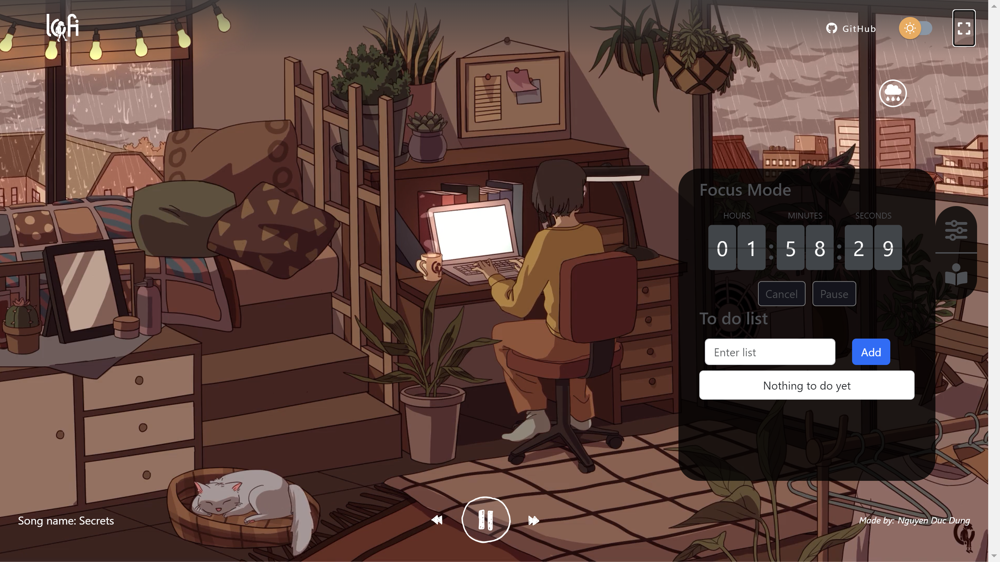
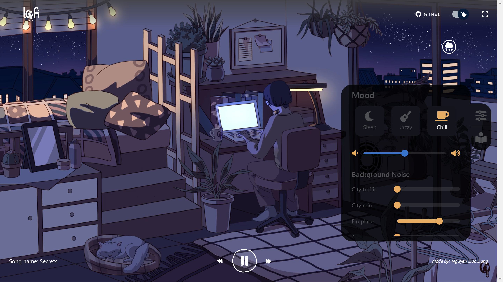

Lofi Music Website

Welcome to the Lofi Music Website, a React.js-powered platform designed to immerse you in the calming world of lofi music. With its minimalistic design and intuitive features, this website offers a relaxing experience for lofi enthusiasts. Whether you're studying, working, or unwinding, the Lofi Music Website creates the perfect ambiance.

Features
🎵 Seamless Music Player:

Play, pause, and skip tracks with ease.
Adjust the volume to match your mood.
Enjoy a curated selection of soothing lofi tracks.
🌌 Aesthetic User Interface:

Minimalistic and calming design for a distraction-free experience.
Responsive layout optimized for both desktop and mobile devices.
🚀 Performance Optimized:

Fast load times and smooth transitions for uninterrupted listening.
Getting Started
Prerequisites
Ensure you have the following installed on your system:

Node.js (v14 or later)
Yarn package manager
Installation Steps
Clone the Repository
bash
Copy code
git clone https://github.com/AyushKumar1810/lofi-chill.git
Navigate to the Project Directory
bash
Copy code
cd lofi-music-website
Install Dependencies
bash
Copy code
yarn install
Start the Development Server
bash
Copy code
yarn start
Open the Website
Visit http://localhost:3000 in your browser.
Contributing
We welcome contributions to make the Lofi Music Website even better!
Follow these steps to contribute:

Fork the repository.
Create a new branch: git checkout -b feature/your-feature-name.
Commit your changes: git commit -m 'Add your feature description'.
Push to the branch: git push origin feature/your-feature-name.
Submit a pull request.
Known Issues
Some browsers may require additional permissions to autoplay music.
Mobile users might experience limited control options due to screen size.
Future Enhancements
🎧 Add customizable playlists.
🌟 Implement a dark mode option.
📊 Include a "Now Playing" feature with visualizations.
📱 Optimize the experience for smaller devices.
License
This project is licensed under the MIT License.

Acknowledgments
Special thanks to the creators of the lofi tracks featured on this website.
Inspired by the global lofi community.
Feel free to reach out or report issues via the Issues Page. Enjoy the vibe! ✨